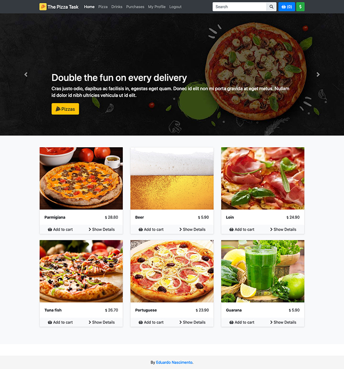

<h1>Task description</h1>
Let’s imagine you want to start a new pizza delivery business. Please create a small web application for online pizza ordering. The idea is to make a non-existing service where assumed clients can choose a pizza, put it into a cart and make an order.

<h1>Requirements</h1>
<ul>
 <li>The menu page should contain at least 8 pizzas</li>
 <li>Your clients should be able to choose pizzas directly from the menu</li>
 <li>You can decide what else you want in the menu</li>
 <li>Adding a description for each pizza would be a nice decision</li>
 <li>Don’t proceed to the payment page. The last action from a client will be filling in the order form (address, name, surname, etc.) to get a confirmation that the order has been received</li>
 <li>A client should be able to put several pizzas into cart, and the quantity must be defined both while outside the cart and in the cart</li>
 <li>Total price of each order must be calculated and shown in euros and in dollars</li>
 <li>Don’t forget to add delivery costs to the final bill</li>
</ul>

<h1>Steps</h1>
The steps for the development of this project will be detailed below and were written as the project progressed.

<h2>1° Step</h2>
The first step will be the creation of the system routes. Before starting to define the routes, I usually draw the page map on paper. Initially all routes are accessible and I am gradually protecting them with a login system.

<h2>2° Step</h2>
<h3>Part 1</h3>
After creating the routes, I started creating the views, for that I used Bootstrap 4. I like themes that use this CSS framework, although there are others. At Laravel I used Blade to create templates and to start creating the screens, I created a "layout" folder that will contain the base of the layout.
<ul>
 <li>Home layout created</li>
 <li>The menu already has a link for each of the areas</li>
 <li>The skeleton of the site is also working</li>
 <li>Visual frameworks installed: Bootstrap 4 and Font Awesome 6</li>
</ul>

<h3>Part 2</h3>
Other system screens were created and I added a lightbox to display the images. There are still a few more screens left to be done before I start modelling.

<h3>Part 3</h3>
I finished all screens and now I will start to create the models.

<h2>3° Step</h2>
I created all the Models and the table links. With Laravel we have the ease of creating Models and Migrations together, which facilitates the abstraction of the solution.

<h2>4° Step</h2>
I created some data in the system through Seeds, in addition to inserting 4 images for each product. The products were divided into two categories: Pizzas and Drinks.

<h2>5° Step</h2>
In this step I created the product controllers and integrated them with their respective views. I reduced the code, implemented the area filters using the URL parameters, which allowed me to use the same controller and the same view for any product category.

<h2>6° Step</h2>
In this step, the entire login and profile management systems were implemented. Now the user can register and update his profile information on the respective pages. As Laravel uses Boostrap, little changes were made to the layout, however several custom fields were added to the user profile.

<h2>7° Step</h2>
I have finished implementing the ordering system. Orders are placed in the system and saved in the database.

<h2>8° Step</h2>
I implemented the script that changes the store's currency.

<h1>Considerations</h1>

I could have used a ready-made online store, like Prestashop or WooCommerce, to develop the system, but I preferred to develop it from scratch in Laravel to consolidate my knowledge.

The layout used is Boostrap 4, but I prefer to use more complete HTML templates like the one I used on the sys.forumdelivery.com.br website.

